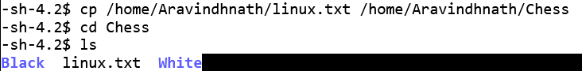

# Cloud Security Lab 1: Linux Commands Study

## Introduction to Linux

**Linux** is an open-source operating system, and its kernel is the heart of the OS, facilitating communication between hardware and software. One of the key advantages of Linux is its customizability; developers can modify the Linux kernel to create their own tailored operating systems.

## Linux Commands

Linux commands are executed in the terminal, which is case-sensitive. This guide covers some basic and advanced commands used in Linux.

### 1. `ls` Command
```bash
ls
```
**Output:**  


### 2. `pwd` Command
```bash
pwd
```
**Output:**  


### 3. `mkdir` Command
```bash
mkdir <directory_name>
```
**Output:**  


### 4. `rmdir` Command
```bash
rmdir <directory_name>
```
**Output:**  


### 5. `cd` Command
```bash
cd <directory_name>
```
**Output:**  


### 6. `cat` Command
```bash
cat [OPTION]... [FILE]...
```
**Output:**  


### 7. `cp` Command
```bash
cp <source_file> <destination_file>
```
**Output:**  


### 8. `head` Command
```bash
head <file_name>
```
**Output:**  


### 9. `id` Command
```bash
id
```
**Output:**  


### 10. `whoami` Command
```bash
whoami
```
**Output:**


## Result
  Hence, We have successfully executed all the commands.
